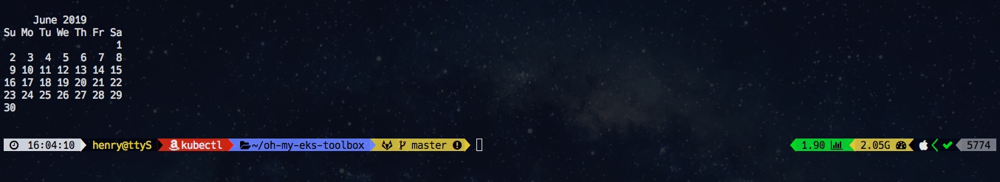
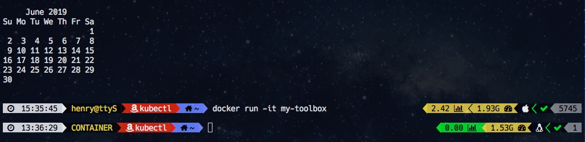

# oh-my-eks-toolbox

Dockerfile to create an [EKS](https://aws.amazon.com/eks) toolbox container with tools like: kubectl, eksctl, helm, aws-iam-authenticator, awscli and terraform all used in a [oh-my-zsh](https://ohmyz.sh/) with [powerlevel 9k](https://github.com/bhilburn/powerlevel9k) 
and much more...

This image is build on [amazon linux 2](https://aws.amazon.com/amazon-linux-2) and can be used as a complete toolbox. One of the features I like is when you are in a container, this is shown on the left prompt (hint: yellow text).

## the prompt configuration

Host OS:


Container:


In above screenshot we see on the left prompt

- time
- user context (hard coded in this example)
- default awscli profile
- current working directory
- git status

on the right prompt, from right to left:

- history
- exit status of previous command
- OS
- RAM free
- sysload

## running this

You can clone and build this repo or get existing image from the hub

```
$ docker run -it oh-my-eks-toolbox
```

