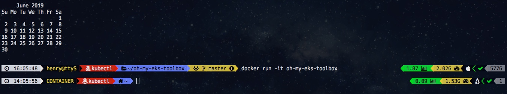

# oh-my-eks-toolbox

Dockerfile to create and [EKS](https://aws.amazon.com/eks) toolbox container with tools like: kubectl, eksctl, helm, aws-iam-authenticator, awscli and terraform all used in a [oh-my-zsh](https://ohmyz.sh/) with [powerlevel 9k](https://github.com/bhilburn/powerlevel9k) 
and much more...

This images is build on amazon linux 2 and can be used as a complete toolbox.

## show me when I am inside a container

When a container is executed the left prompt shows this (hint: yellow text)

